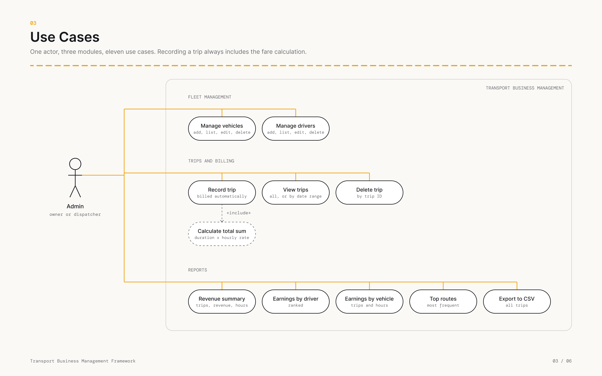
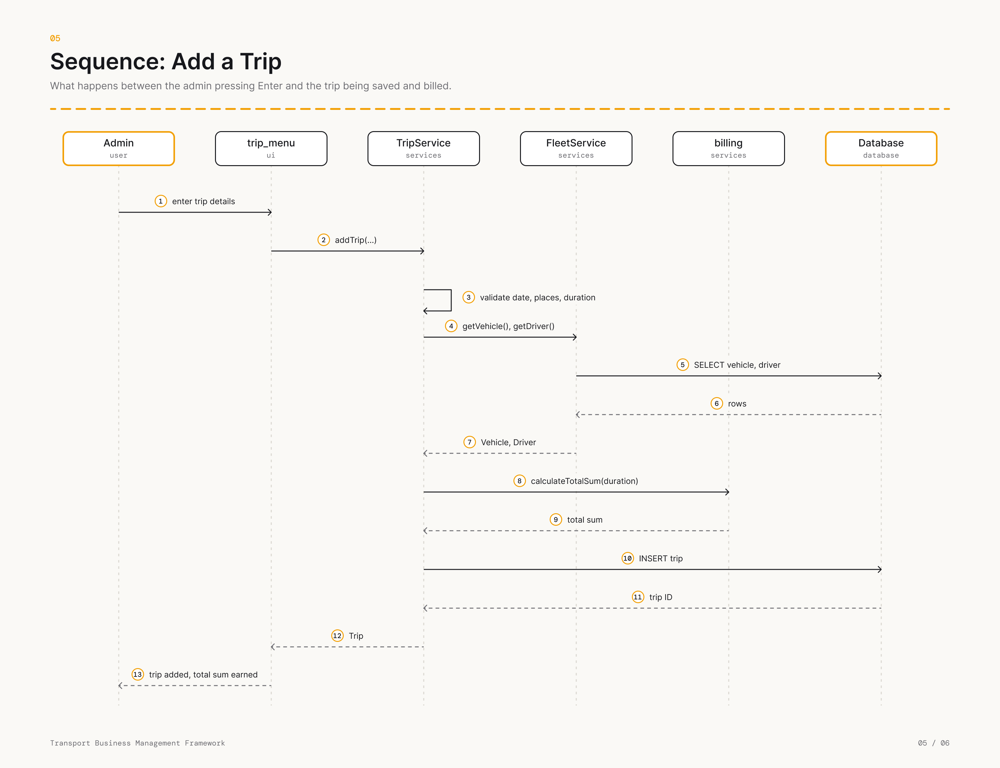

# Transport Business Management Framework

## Overview
A command-line application for a small transport business. It manages the fleet (vehicles and drivers), records
trips and bills them automatically at an hourly rate, and produces revenue reports. Data is stored in a SQLite database
and every operation is validated, logged and covered by unit tests.

## Features
- **Fleet management**: add, list, update and delete vehicles and drivers, with unique vehicle and licence numbers.
- **Trips and billing**: record trips (`HH:MM:SS` duration), total sum earned is calculated at the hourly rate
  (default 500), filter trips by date range, delete trips.
- **Reports and analytics**: revenue summary for a date range, earnings per driver and per vehicle, most popular
  routes, CSV export of all trips.
- **Validation**: names, phone numbers, vehicle and licence numbers, capacities, dates and durations.
- **Logging**: every important action and error is written to `logs/transport.log`.

## Technologies
Python 3.10+ (uses `match`/`case`), `sqlite3`, `csv`, `logging`, `unittest`. No third-party packages are needed.

## Project structure
```
Transport_Business_Management_Framework/
├── transport/
│   ├── __main__.py            entry point (python -m transport)
│   ├── config.py              rate per hour, database and log paths
│   ├── logger.py              logging setup
│   ├── database/              connection wrapper and schema
│   ├── models/                Vehicle, Driver, Trip
│   ├── services/              validators, billing, fleet, trip and report services
│   └── ui/                    menus and input helpers
├── tests/                     unit tests
├── docs/design.md             architecture, UML, workflow and ER diagrams
├── docs/diagrams/             diagram images (PNG)
├── statement.md               problem statement and scope
└── requirements.txt
```

## Install and run
```
python --version          # 3.10 or newer
python -m transport
```
Settings can be changed with environment variables: `TRANSPORT_DB` (database file, default `transport.db`)
and `TRANSPORT_LOG` (log file, default `logs/transport.log`). The hourly rate is `ratePerHour` in `transport/config.py`.

## Testing
Run from inside `Transport_Business_Management_Framework` (the folder this README is in, not its parent):
```
cd Transport_Business_Management_Framework   # skip if you are already inside it
python -m unittest discover -v
```
Running `discover` from the parent folder reports "Ran 0 tests" — that folder has no `__init__.py`, so
`unittest` never descends into it. `cd` into the project folder first.

The tests use an in-memory database, so nothing on disk is touched (apart from the log file).

## Screenshots
Design diagrams (see [docs/design.md](docs/design.md) for the full write-up):

| | |
|---|---|
|  |  |
|  |  |
|  |  |

## Documentation
See [statement.md](statement.md) for the problem statement and [docs/design.md](docs/design.md) for the design
diagrams and non-functional requirements.
