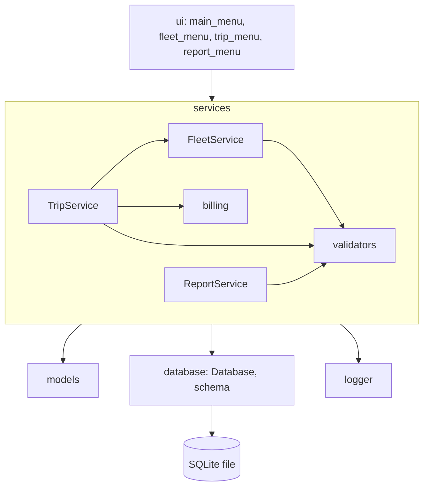
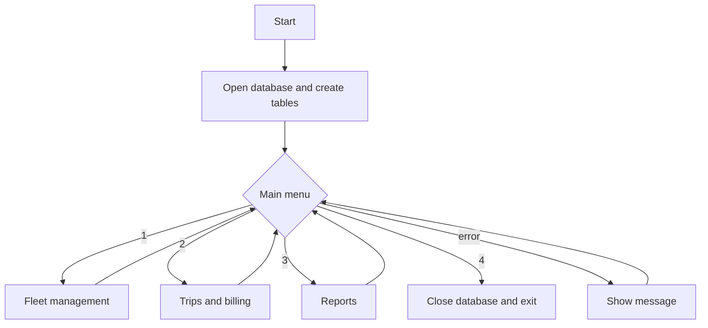
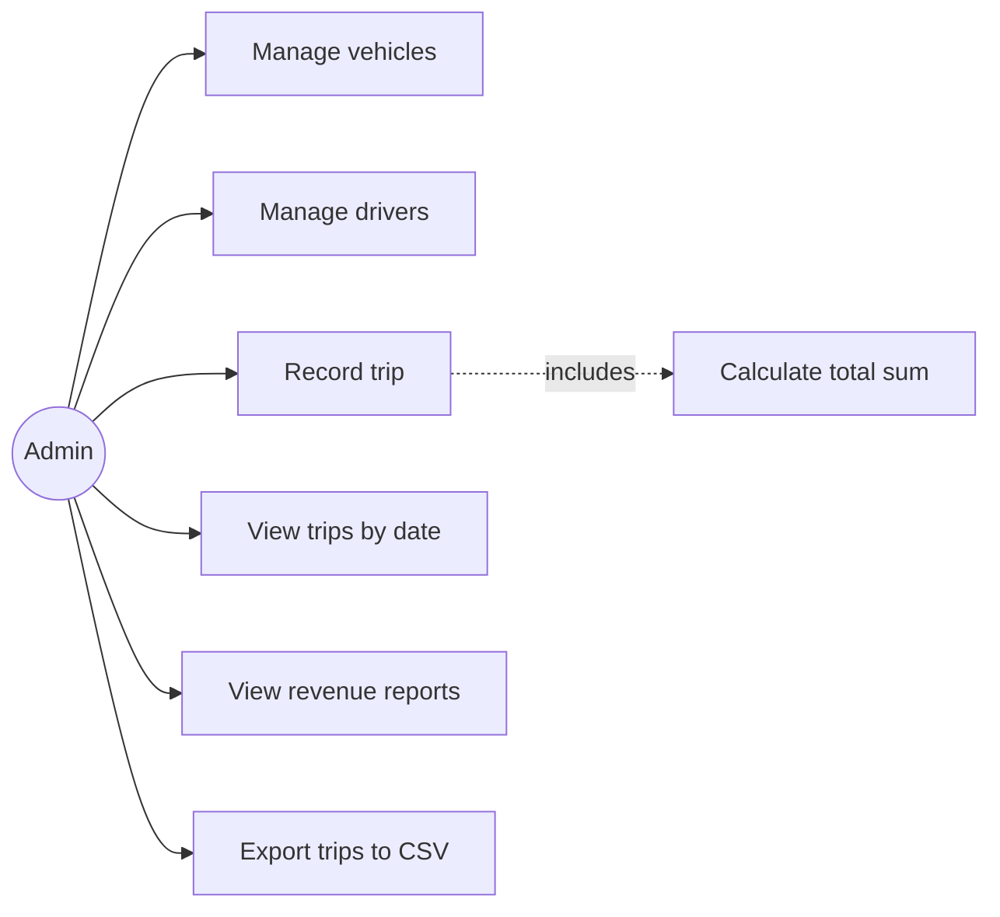
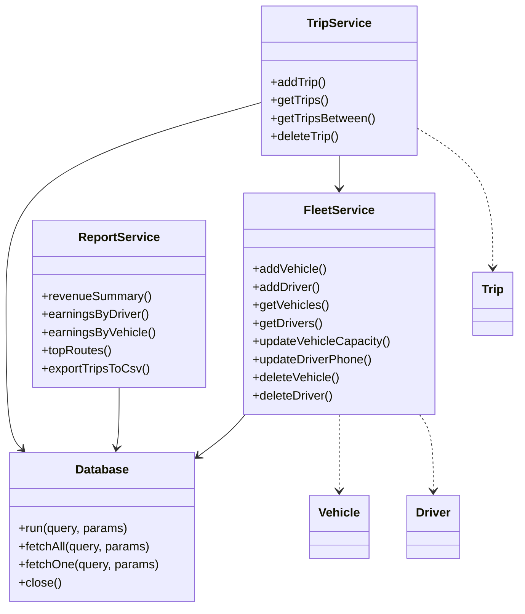
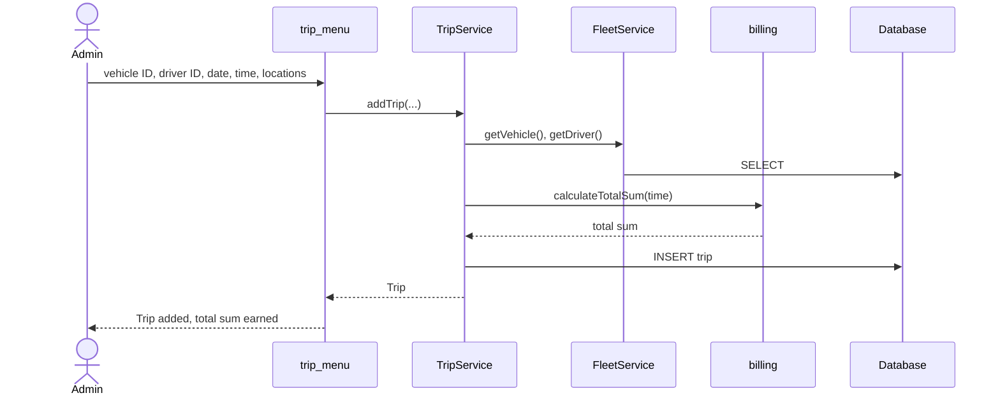
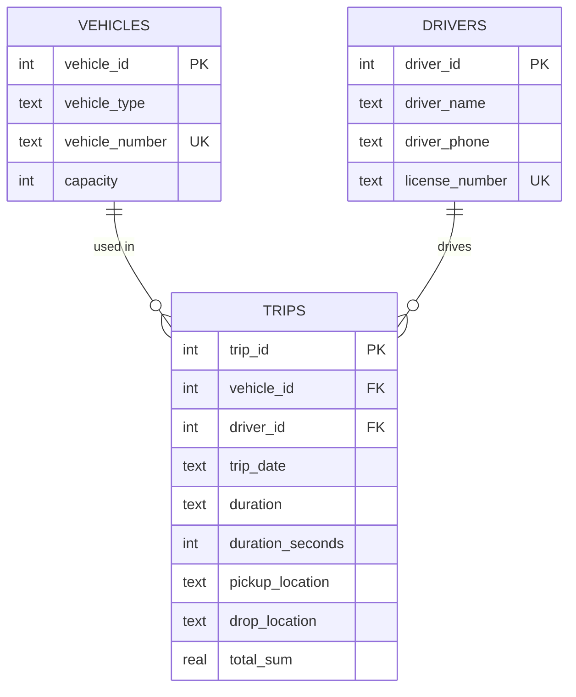

# Design Document

## Objectives
- Replace manual record keeping with a validated database.
- Calculate trip fares automatically and consistently.
- Give the owner a clear view of earnings.

## Functional requirements
| ID | Module | Requirement |
|----|--------|-------------|
| F1 | Fleet | Add, list, update and delete vehicles and drivers; vehicle and licence numbers are unique. |
| F2 | Trips | Record a trip for an existing vehicle and driver; total sum = duration in hours x rate per hour. |
| F3 | Trips | List all trips, list trips between two dates, delete a trip. |
| F4 | Reports | Revenue summary for a date range, earnings per driver and per vehicle, top routes. |
| F5 | Reports | Export all trips to a CSV file. |

## Non-functional requirements
| Type | How it is met |
|------|---------------|
| Security | Every query is parameterised (no SQL injection, covered by a test); no credentials are stored or needed. |
| Reliability | Every write runs in a transaction; foreign keys and CHECK constraints protect data integrity; records with trips cannot be deleted. |
| Usability | Numbered menus, friendly messages, clear error text, and a bad entry never ends the program. |
| Maintainability | Layered packages (database, models, services, ui), small typed functions, no logic in the UI layer. |
| Error handling | Validation raises `ValueError` with a full sentence; the menu catches errors and shows them. |
| Logging | Actions, warnings and database errors go to `logs/transport.log`. |
| Testability | Services take a `Database` object, so tests use an in-memory database. |

## System architecture

## Workflow

## Use case diagram

## Class diagram

## Sequence diagram: adding a trip

## ER diagram

## Design decisions
- **SQLite instead of MySQL**: the original idea was to use a MySQL server and a root password. SQLite ships with Python, so the project runs anywhere, and tests can use an in-memory database.
- **Service layer**: all rules live in services, so the menus only read input and print output.
- **`duration_seconds` column**: durations are stored as text for display and as seconds for fast, exact aggregation in reports.
- **Deletion guard**: vehicles and drivers with recorded trips cannot be deleted, so earnings history is never lost.
